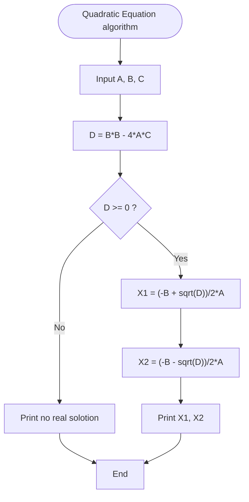

# NoteApp
This is an simple note app.
### Test Mermaid Here

```mermaid
graph TD
	X([Quadratic Equation algorithm]) --> A[Input A, B, C]
  A--> B[D = B*B - 4*A*C]
  B-->C
  C{D >= 0 ?}  
  C -->|No| D[Print no real solotion]
  C -->|Yes| E["X1 = (-B + sqrt(D))/2*A"]
  E --> F["X2 = (-B - sqrt(D))/2*A"]
  F --> G[Print X1, X2 ]

  D & G -->H[End]

```
